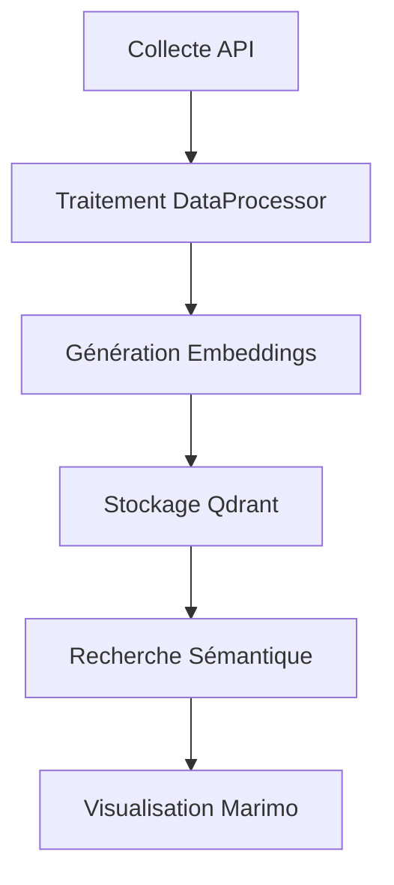

# News Vector Search: Recherche Vectorielle d'Articles de Presse

## Description Détaillée du Projet

News Vector Search est un système avancé de traitement et de recherche d'articles de presse, conçu pour transformer la façon dont nous interagissons avec les contenus médiatiques.

## Architecture du Système

### 1. Collecte des Données

#### Source de Données
- Collecte quotidienne via l'API NewsAPI
- Récupération d'articles de diverses sources françaises
- Stockage initial dans des fichiers CSV dans le répertoire `data/raw/`

#### Script de Collecte
Le script `get_articles_from_api.py` automatise la récupération quotidienne des articles, avec les étapes suivantes :
- Authentification via token NewsAPI
- Filtrage des articles par langue (français)
- Nettoyage initial des métadonnées
- Sauvegarde dans des fichiers CSV datés

### 2. Traitement des Données (`DataProcessor`)

#### Étapes de Nettoyage et Transformation
1. **Chargement des Données**
   - Lecture de tous les fichiers CSV du répertoire `data/raw/`
   - Concaténation des fichiers en un DataFrame unique

2. **Nettoyage du Contenu**
   - Suppression des articles avec contenu ou auteur manquant
   - Filtrage des articles de sources non pertinentes (e.g. Google News)
   - Élimination des doublons

3. **Standardisation**
   - Normalisation des dates
   - Sélection et renommage des colonnes pertinentes
   - Conversion en objets `NewsArticle` avec validation Pydantic

### 3. Génération d'Embeddings (`EmbeddingService`)

#### Modèle d'Embedding
- Utilisation du modèle BGE (BAAI/bge-large-en-v1.5)
- Optimisé pour la langue française
- Génération de vecteurs de 1024 dimensions

#### Processus de Vectorisation
1. Concaténation du titre et du contenu
2. Tokenization avec troncature à 512 tokens
3. Calcul de l'embedding moyen pondéré
4. Mise en cache LRU pour optimisation des performances

### 4. Recherche Sémantique (`SearchService`)

#### Stockage Vectoriel avec Qdrant
- Base de données vectorielle pour stockage et recherche rapide
- Utilisation de la distance cosinus pour la similarité
- Indexation des articles avec leurs métadonnées

#### Fonctionnalités de Recherche
- Recherche par similarité sémantique
- Filtrage par date
- Calcul de scores de similarité

### 5. Visualisation Interactive

#### Notebook Marimo
- Exploration des articles via interface réactive
- Visualisation 3D des embeddings
- Graphiques de similarité temporelle
- Analyse interactive des résultats

## Workflow Complet

### Pipeline d'Exécution Quotidien
1. GitHub Action déclenche la mise à jour
2. Collecte des nouveaux articles
3. Traitement et nettoyage
4. Génération des embeddings
5. Mise à jour de la base de données Qdrant

## Cas d'Usage

- Veille médiatique thématique
- Analyse de tendances journalistiques
- Recherche contextuelle approfondie
- Exploration de corpus documentaires

## Technologies Avancées

- Modèles de language transformer
- Réduction de dimensionnalité (t-SNE)
- Stockage vectoriel
- Visualisation interactive

## Perspectives d'Amélioration

- Intégration de modèles multilingues
- Analyse de sentiments
- Recommandation d'articles
- Exploration de clustering sémantique